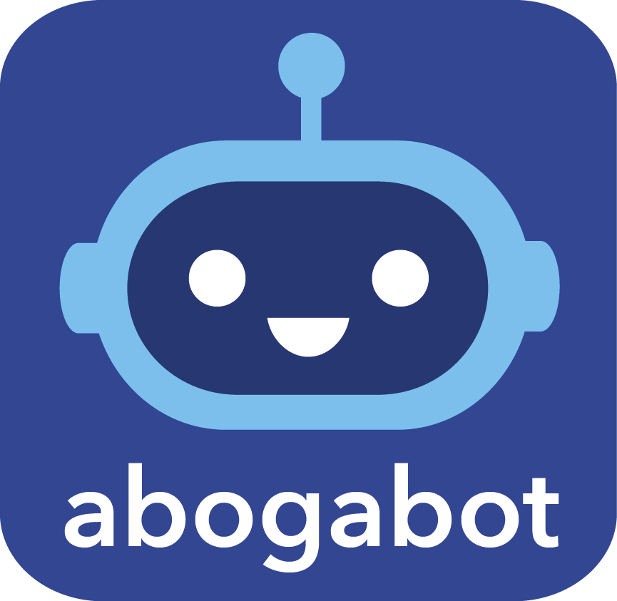

# Practicas_FrontEnd_01_INTRO
---
Estas son las prácticas de la primera misión '01-Introducción' de FrontEnd del programa LaunchX-Innovacción Virtual.

Se tiene el caso siguiente:

**Caso: Abogabot**

Descripción: 
- Es un despacho de abogados que quiere automatizar las demandas de sus clientes, esto lo harán a traves de una página web llenando un formulario.
- Al momento de llenar el formulario se manda al proceso de pago para finalizar la transacción.
- Para dar seguimiento a su demanda, el cliente crea una cuenta en la plataforma y verá el seguimiento de cada una de las actualizaciones del proceso legal.
- El administrador del sitio recbe la notificación de una nueva demanda y con los datos llenados del formulario se crea automaticamente el documento  legal en formato word para empezar el proceso.
- El administrador recibe el pago y debe de ser capaz de verlo en un dashboard para ver la cantidad de ingresos recibidos.
- El administrador actualiza el proceso de la demanda y agrega comentarios en cada paso del proceso.
- Al usuario le llegan correos de notificación para saber el avance de su proceso.
- La página debe de ser responsive para poderla ver desde el celular.
- La preferncia de colores del cliente es azul marino y blanco, pero acepta propuestas.

---

**Practicas**

[1. Toma de requerimientos](https://github.com/xoarsi/Practicas_FrontEnd_01_INTRO/blob/07904ceca22c1c4ccb327015f4d926c1a20051a9/1.-%20Fases%20de%20requerimiento%20de%20software%20ABOGABOT.pdf)

[2. Crear el buyer persona](https://github.com/xoarsi/Practicas_FrontEnd_01_INTRO/blob/07904ceca22c1c4ccb327015f4d926c1a20051a9/2.-%20Buyer%20persona%20ABOGABOT.pdf)

[3. Determinar el público objetivo](https://github.com/xoarsi/Practicas_FrontEnd_01_INTRO/blob/07904ceca22c1c4ccb327015f4d926c1a20051a9/3.-%20P%C3%BAblico%20objetivo%20ABOGABOT.jpg)

[4. Crear el Wireframe UX](https://github.com/xoarsi/Practicas_FrontEnd_01_INTRO/blob/07904ceca22c1c4ccb327015f4d926c1a20051a9/4.-%20Wireframe%20UX%20ABOGABOT.png)

[5. Crear un prototipo de UI](https://github.com/xoarsi/Practicas_FrontEnd_01_INTRO/blob/07904ceca22c1c4ccb327015f4d926c1a20051a9/5.-%20UI%20ABOGABOT.pdf)

---

**Diagramas de la toma de requerimientos**

[Figura 1.- Diagrama de actividad de modelamiento de negocio](https://github.com/xoarsi/Practicas_FrontEnd_01_INTRO/blob/ac48dc6d625c4bc7c72cb66764a9dcb4aa4b999a/Fig%201.-%20Diagrama%20de%20actividad%20ABOGABOT.png)

[Figura 2.- Diagrama de planeación](https://github.com/xoarsi/Practicas_FrontEnd_01_INTRO/blob/ac48dc6d625c4bc7c72cb66764a9dcb4aa4b999a/Fig%202.-%20Diagrama%20de%20planeaci%C3%B3n%20ABOGABOT.png)

[Figura 3.- Diagrama de clases](https://github.com/xoarsi/Practicas_FrontEnd_01_INTRO/blob/ac48dc6d625c4bc7c72cb66764a9dcb4aa4b999a/Fig%203.-%20Diagrama%20de%20clases%20ABOGABOT.png)

[Figura 4.- Diagrama de componentes](https://github.com/xoarsi/Practicas_FrontEnd_01_INTRO/blob/ac48dc6d625c4bc7c72cb66764a9dcb4aa4b999a/Fig%204.-%20Diagrama%20de%20componentes%20ABOGABOT.png)

[Figura 5.- Diagrama de flujo de vista del proceso](https://github.com/xoarsi/Practicas_FrontEnd_01_INTRO/blob/ac48dc6d625c4bc7c72cb66764a9dcb4aa4b999a/Fig%205.-%20Diagrama%20flujo%20ABOGABOT.png)

[Figura 6.- Diagrama UML de despliegue](https://github.com/xoarsi/Practicas_FrontEnd_01_INTRO/blob/ac48dc6d625c4bc7c72cb66764a9dcb4aa4b999a/Fig%206.-%20Diagrama%20UML%20de%20despliegue%20ABOGABOT.png)

[Figura 7.- Boceto de Interface. Parte superior](https://github.com/xoarsi/Practicas_FrontEnd_01_INTRO/blob/ac48dc6d625c4bc7c72cb66764a9dcb4aa4b999a/Fig%207.-%20Boceto%20de%20interface%20ABOGABOT%20PS.jpg)

[Figura 8.- Boceto de Interface. Parte inferior](https://github.com/xoarsi/Practicas_FrontEnd_01_INTRO/blob/ac48dc6d625c4bc7c72cb66764a9dcb4aa4b999a/Fig%208.-%20Boceto%20de%20interface%20ABOGABOT%20PI.jpg)
  
---

**Logos**  

[ABOGABOT](https://github.com/xoarsi/Practicas_FrontEnd_01_INTRO/blob/ac48dc6d625c4bc7c72cb66764a9dcb4aa4b999a/ABOGABOT.png)

[Abogados Asociados](https://github.com/xoarsi/Practicas_FrontEnd_01_INTRO/blob/ac48dc6d625c4bc7c72cb66764a9dcb4aa4b999a/Abogados%20Asociados.png)

[In-Tech](https://github.com/xoarsi/Practicas_FrontEnd_01_INTRO/blob/ac48dc6d625c4bc7c72cb66764a9dcb4aa4b999a/In-Tech.png)

 
 ***¡Vámonos hasta el espacio y más allá!***
